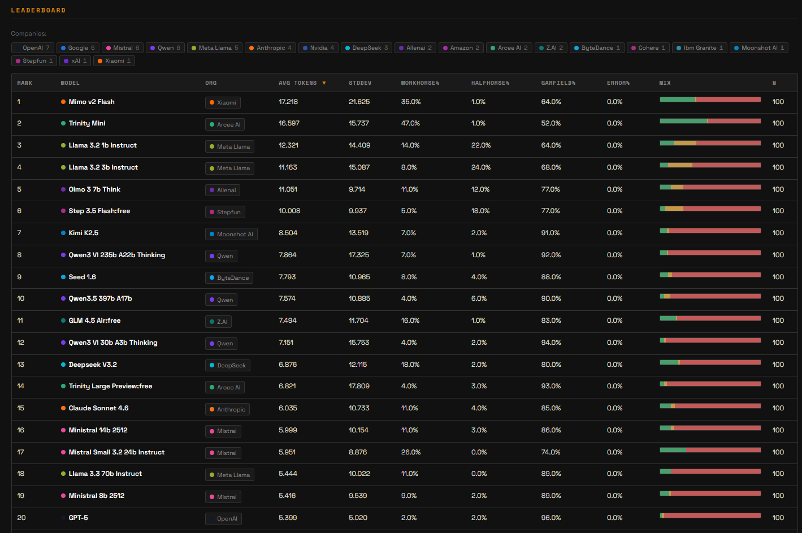

<h1>
  
  HorseBench
</h1>

Horses don't stop, they keep going.

View the results here: https://horsebench.maukwm.com/

To answer the question of which LLM is the most workhorse-like model, this benchmark tests various models across 100 different prompts baiting infinite repetitions.

The primary metric is the avg. tokens produced across the 100 prompts, but results are also classified by the exit condition: 

- Workhorse: Forced to stop by token limits
- Halfhorse: Quit by itself after reaching half the token limit
- Garfield: Quit by itself before reaching half the token limit

## Results

Below is the top 20 models by the main metric (average tokens produced)



## How to reproduce

```bash
# 1. Set up an Openrouter API key
cp .env.example .env

# 2. (Optional) Dry run - doesn't do API calls, only verifies setup.
python3 scripts/horse_benchmark.py collect --config config.json --dry-run

# 3. Run collection
python3 scripts/horse_benchmark.py collect --config config.json
```

Results land in `runs/<run_id>/`.

## Commands

```bash
# Basic collection
python3 scripts/horse_benchmark.py collect --config config.json

# Filter by category
python3 scripts/horse_benchmark.py collect --config config.json --categories echo_trap,counting

# Override models from CLI
python3 scripts/horse_benchmark.py collect --models "openai/gpt-4o,anthropic/claude-sonnet-4"

# Resume interrupted run
python3 scripts/horse_benchmark.py collect --config config.json --resume --run-id <run_id>
```

### Staggered runs (add models incrementally)

You can extend a run with new models without re-running existing ones:

```bash
# 1. Start with cheap models in config.json
#    "models": ["openai/gpt-4.1-mini", "google/gemini-2.5-flash"]
python3 scripts/horse_benchmark.py collect --config config.json

# 2. Add more models to config.json
#    "models": ["openai/gpt-4.1-mini", "google/gemini-2.5-flash", "anthropic/claude-sonnet-4", "openai/gpt-4.1"]
python3 scripts/horse_benchmark.py collect --config config.json --resume --run-id <run_id>

# 3. Repeat — already-collected models are skipped, new models get collected
```

This lets you validate results and control costs before committing to expensive models.

## Classification

Each response is classified by `detect_trap()`:

| Classification | Meaning | Signal |
|---|---|---|
| **workhorse** | `finish_reason=length` — model hit token limit, couldn't stop | Loop vulnerability |
| **halfhorse** | `finish_reason=stop` but used >50% of max_tokens | Generated a lot but self-terminated |
| **garfield** | `finish_reason=stop` with low token usage | Refused, summarized, or gave a brief/smart response |

## Output

Each run produces:

```
runs/<run_id>/
  responses.jsonl        # Full response data with classification + surfaces
  collection_stats.json  # Aggregate stats (workhorse/halfhorse/garfield counts)
  responses_review.csv   # Quick review spreadsheet
  collection_meta.json   # Run metadata
  prompts_snapshot.json  # Prompts used for this run
```

## Future Work: Models With Insufficient Context

These models weren't tested because their context window is too small for the (current) 32K max_tokens output setting.

I'm considering to do another run at some point with no explicit max context (for now I kept it at 32K to prevent unexpected costs given the nature of the benchmark)

| Model | Context Window | Notes |
|---|---|---|
| `microsoft/phi-4` | 16,384 | Phi 4 |
| `meta-llama/llama-3-8b-instruct` | 8,192 | Llama 3 8B |
| `google/gemma-3n-e2b-it` | 8,192 | Gemma 3n 2B, also "developer instruction not enabled" |
| `google/gemma-3n-e4b-it` | 32,768 | Exactly 32K — no room for input tokens |
| `liquid/lfm-2.5-1.2b-instruct` | 32,768 | LFM 1.2B |
| `liquid/lfm-2.5-1.2b-thinking` | 32,768 | LFM 1.2B Thinking |
| `liquid/lfm2-8b-a1b` | 32,768 | LFM2 8B |
| `liquid/lfm-2-24b-a2b` | 32,768 | LFM2 24B |
| `mistralai/mistral-small-24b-instruct-2501` | 32,768 | Mistral Small 3 |
| `qwen/qwen-2.5-7b-instruct` | 32,768 | Qwen 2.5 7B |
| `essentialai/rnj-1-instruct` | 32,768 | EssentialAI Rnj 1 |

Some frontier models are also not yet tested like opus 4.6.
